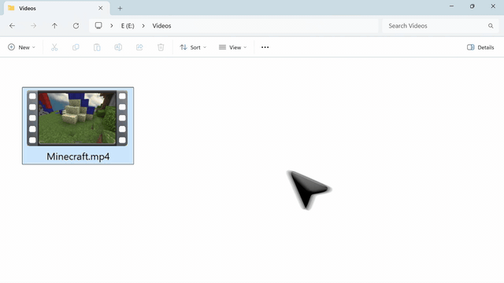

# Flect

**Right-click any files or folders on the Windows Explorer to convert, compress, resize and more!**

You don't have to search for converter on the browser or compress using Video Editor.

<p align="center">
  
</p>

## Installation

1. Download the latest `Flect-Setup.exe` from [Releases](https://github.com/Konayukiw/Flect/releases/latest).
2. Run Setup and complete installation.
3. Right-click any file or folder and choose **Show more options** to find Flect.

> **Why "Show more options"?**  - Windows 11 gives its short right-click menu. You can bring it up to the top level. See [FAQ](#faq) below.

To change detailed settings, open **Flect** from the Start menu.

---

## Features

**Your original files are never touched.** 

Every process writes a new file next to the original - nothing is overwritten or replaced. If a name is already taken, the new file gets a `(2)` suffix, exactly like Explorer does. 
Deletions go to the Recycle Bin by default and they can be undone. A task that fails or is cancelled cleans up whatever it had written.

Select as many files as you like - these run over the whole selection at once, not one file at a time.

### Images

| | |
| --- | --- |
| **Resize** | Scale down by percentage, or to custom pixels |
| **Compress** | Squeeze down to a target file size |
| **Rotate** | Any angle - corners stay transparent, or turn white if the format has no alpha |
| **Convert** | Between PNG, JPG, WEBP, HEIC, ICO, GIF and SVG |
| **OCR** | Read the text out of an image, to a file, the clipboard, or just on screen |
| **Remove Metadata** | Strip EXIF, GPS coordinates, comments and camera information |
| **Remove Background** | Make one colour transparent |

> OCR requires Windows language pack with OCR enabled. If you haven't downloaded the language you need, read [FAQ](#faq) for language pack setup.

### Videos & audios

| | |
| --- | --- |
| **Resize** | Scale down by percentage or to custom pixels |
| **Trim** | Scrub to the part you want and keep just that - instantly, no re-encoding |
| **Thumbnail** | Export any single frame as a PNG or JPG image |
| **Compress** | Hit a target size - including a one-click Discord preset |
| **Rotate** | Any angle, with a chosen fill colour |
| **Convert** | Between MP4, MOV, MKV, M4A, AVI, WEBM, FLV,  animated GIF |
| **Extract Audio** | Extract soundtrack out to MP3, M4A, WAV, AAC, OGG and more |

### Folders

| | |
| --- | --- |
| **Remove Duplicate** | Find identical files and remove them |
| **Remove Empty** | Clear out empty folders |
| **Tree** | Print the folder structure |
| **Rename** | Batch rename with a custom prefix, suffix or numbering |
| **Analyze** | Show total size, largest files, breakdown by file type, duplicates and empty folders |
| **Compress** | Pack a folder into a ZIP, 7z, TAR or tar.gz |

Duplicates are matched on size, hash and per-byte comparison.

### Archives

| | |
| --- | --- |
| **Extract** | Unpack ZIP, 7z, TAR, tar.gz and RAR archives into a new folder |

RAR is read-only: Flect can extract `.rar` files but cannot create them. This is technical capacity and not caused by my laziness.

### Text files

| | |
| --- | --- |
| **PDF** | Preview, merge several into one, or export to PNG, JPG or TXT |
| **TEXT** | Convert between data formats, change the encoding, or switch line endings |
| **JSON** | Pretty print, sort keys with rules |
| **JAR** | Decompile into a folder of readable Java source |

## Conversion style

| From | To |
| --- | --- |
| **PNG, JPG, WEBP, HEIC, ICO, GIF, SVG** | Any other format in this row |
| **MP4, MOV, MKV, M4A, AVI, WEBM, FLV** | Any other format in this row + GIF |
| **MP3, WAV, AIF, AIFF, AAC, OGG, WMA** | Any other format in this row + M4A |
| Video → **Extract Audio** | MP3, M4A, WAV, AIF, AIFF, AAC, OGG, WMA |
| **PDF** | PNG, JPG, TXT |
| **Any text file** | TXT |
| **CSV** | JSON, XML, HTML, MD |
| **JSON** | CSV, XML |
| **XML** | JSON |
| **INI, CFG, CONF** | JSON, XML |
| **JAR** | A folder of decompiled `.java` sources |
| **Folder** | ZIP, 7z, TAR, tar.gz archive of the folder |
| Text encodings | UTF-8, UTF-8 (BOM), UTF-16, Shift_JIS |
| Line endings | CRLF (Windows), LF (Unix) |

## Settings

Open **Flect** from the Start menu.

- **General** - Theme, language (English / 日本語 / 简体中文), when the progress window closes by itself, and a checkbox for every context-menu entry so you can hide the ones you never use.
- **Folder** - Duplicate matching rules, whether deletions use the Recycle Bin, folders to skip while scanning, rename defaults, what counts as an "empty" folder, and the archive format used by folder compression (ZIP / 7z / TAR / tar.gz).
- **Video** - codec, hardware acceleration (NVENC / Quick Sync / AMF), whether to favour speed or quality, GIF export settings, thumbnail format (PNG / JPG), JPG quality and maximum width, and the rotation fill colour.
- **Image** - WebP fallback for compression, the colour Remove Background keys out, and exactly which metadata gets stripped.
- **Text** - what to do with characters Shift_JIS cannot represent, and JSON key-sorting rules.
- **OCR** - recognition language, where the text goes, and the output encoding.

The menu presets (like `50%`, `10 MB`, `45°` entries) are editable here too.

## Requirements

| | |
| --- | --- |
| **Windows** | 64-bit Windows 11 or Windows 10 |
| **.NET 10 Desktop Runtime** | Required. Setup checks for it and offers the download if it is missing. |
| **HEVC Video Extensions** | Only to *write* `.heic` files. Reading HEIC works without it. From the Microsoft Store. |
| **Java (JDK or JRE)** | Only to decompile `.jar` files. |
| **Windows language pack** | Only for OCR, and only for the language you want to read. Flect's settings can open the installer for you. |

Everything else - the image, video, PDF and decompiler engines - ships inside the installer. There is nothing else to download and nothing is ever uploaded anywhere; every operation runs on your PC.

## FAQ

<details>
<summary><b>Can I get Flect into the first right-click menu?</b></summary>

Yes, by switching Windows 11 back to the classic context menu. It affects every app - though most people find the classic menu more useful anyway.

Open Terminal or Command Prompt and run:

```powershell
reg add "HKCU\Software\Classes\CLSID\{86ca1aa0-34aa-4e8b-a509-50c905bae2a2}\InprocServer32" /f /ve
taskkill /f /im explorer.exe
start explorer.exe
```

To getthe Windows 11 menu back:

```powershell
reg delete "HKCU\Software\Classes\CLSID\{86ca1aa0-34aa-4e8b-a509-50c905bae2a2}" /f
taskkill /f /im explorer.exe
start explorer.exe
```

Both restart Explorer, so your open Explorer windows will close. Nothing else is affected, and the change is per-user - no administrator rights needed.
</details>
　
<details>
<summary><b>Where will the converted files go?</b></summary>

Right next to the original, in the same folder. Originals are never modified or deleted. If the name is taken, Flect adds suffixes like `(2)`, `(3)`.
</details>
　
<details>
<summary><b>Can I undo a deletion?</b></summary>

Yes - Remove Duplicate and Remove Empty move files to the Recycle Bin by default, so you can restore them. How ever if you switch deletion mode to permanent in the settings, you cannot.
</details>
　
<details>
<summary><b>Why did "to HEIC" fail?</b></summary>

Writing HEIC needs the **HEVC Video Extensions** from the Microsoft Store, which Flect cannot bundle.

There is no free-to-use HEIC *encoder* to ship. Windows does have an encoder inside the HEVC Video Extensions, so Flect routes `to HEIC` there through WIC and leaves everything else to ImageMagick.

Reading HEIC works on any machine.
</details>
　
<details>
<summary><b>OCR says there is no recognizer for my language</b></summary>

Flect uses the text recognition built into Windows, which can only read languages whose recognizer is installed on your PC. Open Flect's settings → **OCR** to see what is installed and to add a language. Language packs are little bit heavy and the installer asks for administrator rights.
</details>
　
<details>
<summary><b>How does compressing to a target size work?</b></summary>

For video, Flect works down a ladder and stops at the first rung that gets under your target: repackage the streams, re-encode only the audio, then re-encode the picture - and after that, correct the bitrate using the size the first attempt actually produced and try once more.

The menu deliberately stays short. The depth lives in the settings instead: codec, hardware acceleration, and whether compression is allowed to trade resolution or frame rate for size. For more detailed control, consider using [Compressor](https://compressor-v1.vercel.app).

Video compression stages through a hidden scratch directory next to the destination, so a partial file never appears - the output shows up only once it is complete.
</details>
　
<details>
<summary><b>My trimmed clip starts a bit earlier than I marked</b></summary>

That is the price of not re-encoding. Video is stored in chunks that begin with a keyframe, and the frames after one cannot be decoded without it — so a cut that copies the streams has to begin at the keyframe before your mark, which can be a few seconds early. Everything you asked for is there; there is just a little extra in front, and the file is finished the moment you click.

If you need the cut exactly where you put it, open Flect's settings → **Video → Trim** and choose to land on the exact frame. That re-encodes the clip, so it takes as long as any other encode and loses a little quality.

Trim only appears when you have selected a single video — one start and end cannot mean the same thing across clips of different lengths.
</details>
　
<details>
<summary><b>Why did Explorer restart when I installed?</b></summary>

Explorer loads the menu handler into itself and holds onto it. Installing over a version that has already been used therefore needs Explorer to let go first. Setup does that on its own, and only when the file is genuinely locked.
</details>
　
<details>
<summary><b>The menu has more entries than I need</b></summary>

Open Flect from the Start menu, go to **General → Context menu items**, and untick anything you do not want. Unchecked entries disappear from the Explorer menu entirely.
</details>
　
<details>
<summary><b>Where are my settings stored?</b></summary>

In `%APPDATA%\Flect\settings.json`. The handful of values the Explorer menu itself needs are mirrored to `HKCU\Software\Flect`.

**Reset settings** in the app clears both of those, and nothing else - the shell registration and the learned encoder results stay put.
</details>
　
<details>
<summary><b>How do I uninstall?</b></summary>

Through **Settings › Apps › Installed apps** in Windows, like any other program. Files you have already produced are left alone.
</details>
　
<details>
<summary><b>Known limitations</b></summary>

- Compressed video always comes out as `.mp4`, even when the codec is H.265, VP9 or AV1. The result plays fine but the container/codec pairing is unusual.
- Hardware acceleration is offered only after Flect confirms your GPU can actually encode. It checks the first time you open the settings, and rechecks if you change graphics card or driver. If an encode fails on the GPU anyway, it finishes on the CPU instead.
</details>

---

## For development

### Build

```powershell
.\fetch\get.ps1           # Downloads dependencies
.\build.ps1               # Compiles both halves
.\package.ps1             # Wraps installer
```

- If blocked, insert `powershell -ExecutionPolicy RemoteSigned -File ` at the top of the command.
- `package.ps1` needs Inno Setup (`winget install JRSoftware.InnoSetup`).
- `.\install.ps1` installs the freshly built copy for the current user without going through the installer. Add `-Force` to let it restart Explorer when the DLL is locked.

Flect is two halves: C++ shell extension (`src/Shell`) to render the menu inside Explorer, and a .NET worker (`src/App`) that does the actual processes and manages settings. The menu is a classic `IContextMenu` handler, which is why Windows 11 files it under "Show more options".

### Dependencies

| Purpose | Component | Comes from |
| --- | --- | --- |
| Runtime | .NET 10 Desktop Runtime | Setup automatically checks |
| Images | Magick.NET (ImageMagick) | NuGet |
| Video | ffmpeg / ffprobe | `fetch\get.ps1` |
| Archives | 7-Zip (7za.exe + 7z.exe) | `fetch\get.ps1` |
| PDF | PDFtoImage / PDFium / PdfPig | NuGet |
| Hashing | System.IO.Hashing | NuGet |
| Encoding detection | UTF.Unknown | NuGet |
| Decompile `.jar` | cfr.jar | `fetch\get.ps1` |
| Decompile prerequisite | JDK / JRE | Installed by the user |
| Write HEIC | Windows HEVC Video Extensions | Installed by the user |

---

## License

Flect is licensed under the [Apache License 2.0](LICENSE).

It bundles third-party components under their own licences including ImageMagick, FFmpeg (GPLv3), PDFium, 7-Zip (LGPL) and CFR. Every component, its licence and the full licence text are listed in [THIRD PARTY NOTICE](THIRD-PARTY-NOTICE.md).
